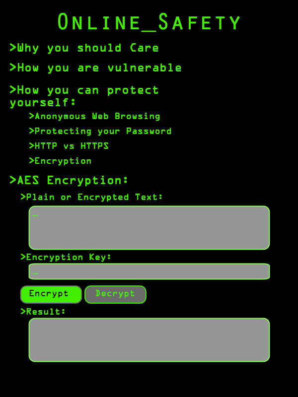

#Advanced Coding Final Project
##Description
For my final project I will be making an interactive online safety guide.  This will serve as a learning tool for both others and myself as I will hopefully be strengthening my own online security through my research for this project.  Much of this information has been made readily available to the public but has been largely ignored so the goal of my project is to present the information in a way that stresses its importance while making it easily understood.  I hope to include information on password managers, anonymous web browsing, HTTPS encryption tools, and any other online safety tools I may discover.  I will also include an AES encryption GUI to demonstrate a simple way people can hide their messages to be shared among friends.  Given the small amount of time left in the quarter I have tried to limit the scope of this project while maintaining its potential effectiveness as a learning tool.
##Concept Sketches

##Addons
ofxTextBox
ofxTextField